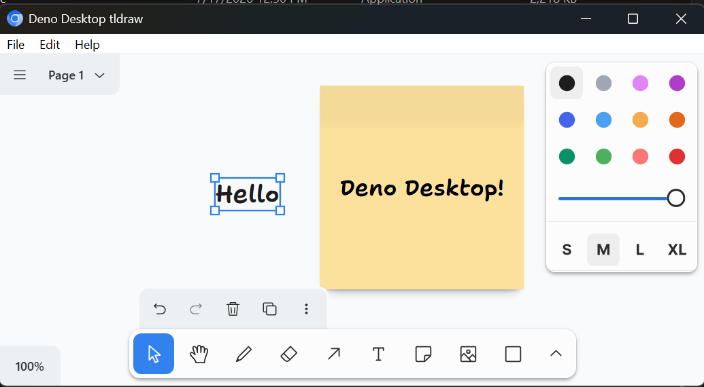

# deno-desktop-tldraw

A minimal template for running the offline [tldraw SDK](https://tldraw.dev/) in
a [`deno desktop`](https://docs.deno.com/runtime/desktop/) application.



The app is a Vite React project with a native Deno Desktop menu. Drawings can be
opened and saved as local `.tldr.json` snapshot files without a server.

## Requirements

- Deno 2.9 or newer

## Quick Start

```sh
deno task desktop:dev
```

This starts Deno Desktop in HMR mode. Deno detects the Vite project, starts the
desktop entry, and opens the desktop webview.

For a normal browser development server:

```sh
deno task dev
```

## Build

Build the web app:

```sh
deno task build
```

Build the desktop app:

```sh
deno task desktop:build
```

The desktop output is written to `dist-desktop/` according to the
platform-specific paths in `deno.json`. The desktop build task cleans generated
output first so old desktop bundles are not embedded into the next build.

## Verify

```sh
deno task check
deno task lint
deno task build
```

## How It Works

- `package.json` and `vite.config.ts` make this a Vite app, which Deno builds
  before packaging the desktop app.
- `desktop.ts` serves the built Vite output and configures the native app menu.
- `src/App.tsx` renders `<Tldraw>` with an in-page file toolbar and keyboard
  shortcuts. It exposes a desktop bridge for native menu commands (kept for
  future backend versions).
- Files use the
  [File System Access API](https://developer.mozilla.org/en-US/docs/Web/API/File_System_API)
  where available (CEF / Chromium). File handles are reused for in-place save.
  When FS Access is absent, the template falls back to `<input type="file">` for
  open and a download blob for save.
- `File -> Open...`, `File -> Save`, and `File -> Save As...` in the native menu
  bar call the same in-page actions via `executeJs`. **On Windows + CEF (Deno
  2.9.3) native `menuclick` events do not fire** — this is
  [a known upstream issue](https://github.com/denoland/deno/issues/36151). The
  in-page toolbar and `Ctrl+O` / `Ctrl+S` / `Ctrl+Shift+S` keyboard shortcuts
  are the blessed path until it is resolved.
- Edit menu items call tldraw's built-in action API for undo, redo, cut, copy,
  paste, and select all.
- `deno.json` contains the Deno Desktop metadata and build output paths.
- The native `Help -> About` menu opens this template's GitHub repository.
- The template uses Deno Desktop's `cef` backend for consistent Chromium
  behavior. The default Windows WebView backend can crash on some WebView2
  installations with this tldraw canvas.

## Customize

- Change the app name and bundle identifier in `deno.json`.
- Replace the banner in `src/App.tsx` with your own UI.
- Add tldraw custom shapes, tools, menus, or asset storage using the SDK docs.

The default tldraw SDK watermark is intentionally preserved. See tldraw's
license terms if you need to remove it.
